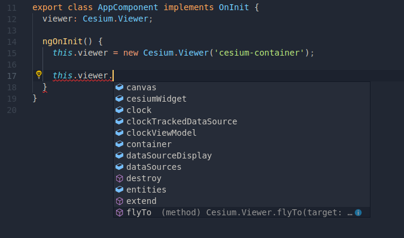

# TypescriptCesium

## The Problem

`import cesium from 'cesium'` doesn't work out-of-the-box with Angular 6 (at the time of this writing).

Until that works, this workaround may be useful.

## Workaround

1. Follow the steps outlined in this blog post: [https://cesium.com/blog/2018/03/12/cesium-and-angular](https://cesium.com/blog/2018/03/12/cesium-and-angular/)

In a nutshell:

- `yarn add cesium @types/cesium`
- Add Cesium assets to angular.json
- `declare var Cesium;` to tell the typescript compiler that the Cesium variable does indeed exist
- Add a `CESIUM_BASE_URL` variable to main.ts
- Instantiate the Cesium Viewer to display Cesium

2. Add a [triple-slash directive](https://www.typescriptlang.org/docs/handbook/triple-slash-directives.html) for `@types/cesium` to the file(s) that invoke Cesium:

```
<reference path="../path/to/node_modules/@types/cesium/index.d.ts" />
```

3. Intellisense should now have suggestions for Cesium.



## Development server

- `ng serve`
- Navigate to `http://localhost:4200/`

## Misc

This project was generated with [Angular CLI](https://github.com/angular/angular-cli) version 6.2.5.